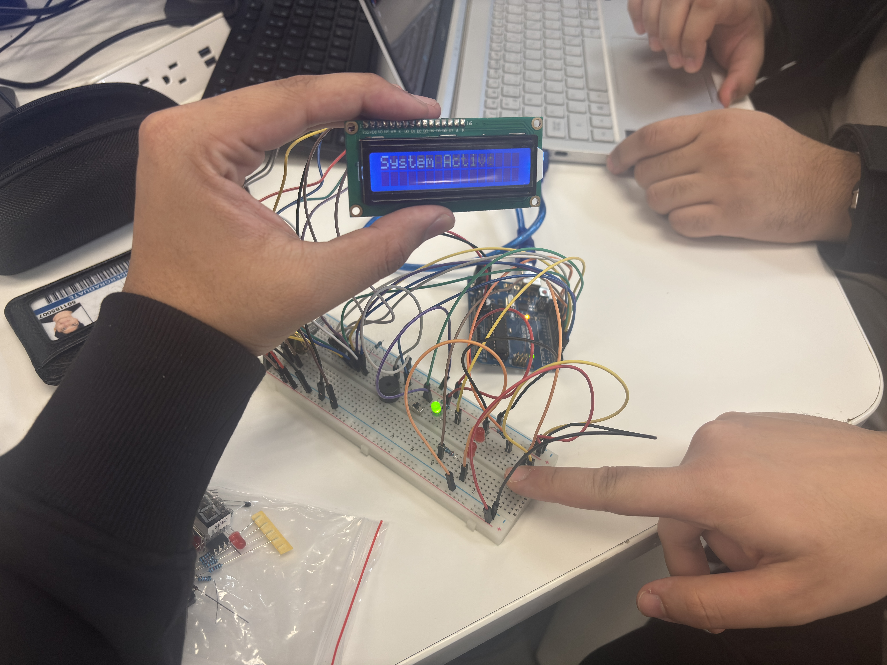
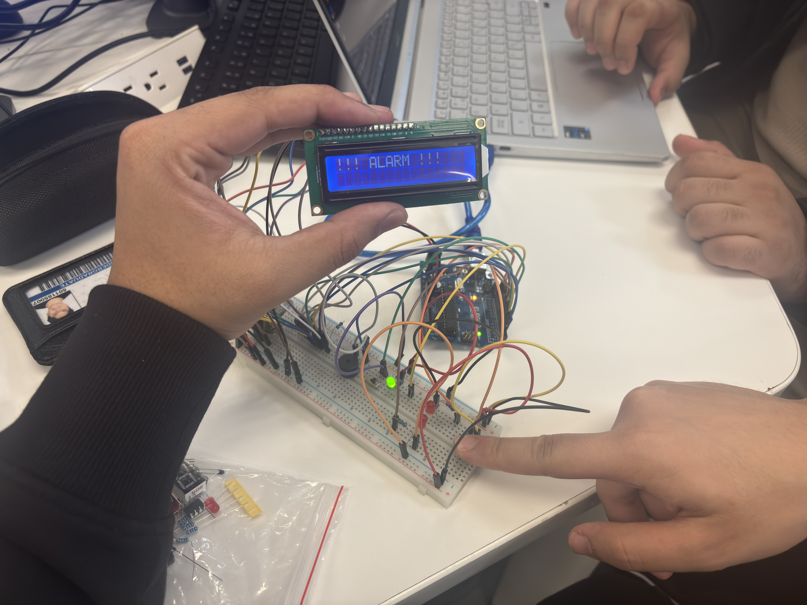

# Multi-Sensory Alert System

[](https://www.arduino.cc/)
[](https://www.python.org/)

A comprehensive alarm monitoring system that integrates Arduino hardware with a Python desktop application, providing multi-platform alerts through visual, auditory, and desktop notification channels.

## 📷 Project Demo

### Hardware in Action
<p align="center">
  
  <br/>
  <em>System in Active State - Green LED indicates system is armed and ready</em>
</p>

<p align="center">
  
  <br/>
  <em>Alarm State - Red LEDs flashing with buzzer active and LCD displaying alert</em>
</p>

## 🎯 Project Overview

This project demonstrates a robust, multi-sensory alert system combining embedded hardware with desktop software monitoring. Perfect for home security, industrial monitoring, or any application requiring reliable multi-channel alerts.

### Key Features

- **Multi-Sensory Hardware Alerts**
  - Visual indicators (Red/Green LEDs)
  - Audio alerts (Active buzzer)
  - LCD status display (16×2)
  
- **Desktop Integration**
  - Real-time Python GUI monitoring
  - Desktop popup notifications
  - Event logging and status tracking
  
- **Safe Operation**
  - Toggle switch for system enable/disable
  - Serial communication (9600 baud)
  - Thread-based serial listening (no GUI freezing)

## 🛠️ Hardware Components

| Component | Quantity | Purpose |
|-----------|----------|---------|
| Arduino Uno | 1 | Main controller |
| 16×2 LCD Display | 1 | Status feedback |
| Red LEDs | 2 | Alarm indicators |
| Green LED | 1 | System active indicator |
| Active Buzzer | 1 | Audio alert |
| Push Button | 1 | Alarm trigger |
| Toggle Switch | 1 | System enable/disable |
| 220Ω Resistors | 3 | LED current limiting |
| Breadboard & Wires | - | Circuit assembly |

## 🔌 Circuit Diagram

### Pin Configuration

```
LCD Connections:
  RS  → D12
  EN  → D11
  D4  → D5
  D5  → D4
  D6  → D3
  D7  → D2
  VCC → 5V
  GND → GND

LEDs & Buzzer:
  Green LED  → D9 → 220Ω → GND
  Red LED 1  → D13 → 220Ω → GND
  Red LED 2  → D10 → 220Ω → GND
  Buzzer     → D8 (+), GND (-)

Switches:
  Toggle Switch → D6 → GND (INPUT_PULLUP)
  Push Button   → D7 → GND (INPUT_PULLUP)
```

## 🔌 Circuit Diagram

<p align="center">
  
  <br/>
  <em>Complete circuit schematic showing Arduino connections</em>
</p>

## 💻 Software Setup

### Prerequisites

- **Hardware:**
  - Arduino Uno with USB cable
  - Assembled circuit (see diagram above)

- **Software:**
  - Arduino IDE (2.3.6 or later)
  - Python 3.7 or later
  - Windows/Mac/Linux with available COM/Serial port

### Python Dependencies

```bash
pip install pyserial plyer
```

Or use the requirements file:

```bash
pip install -r requirements.txt
```

## 🚀 Usage

### Arduino Operation

1. **Power on** the Arduino via USB
2. **Toggle switch ON** (connect to GND) to activate the system
   - Green LED lights up
   - LCD displays "System Active"
3. **Press the push button** to trigger alarm
   - Red LEDs flash
   - Buzzer sounds
   - LCD displays "!!! ALARM !!!"
   - Serial message sent to Python
4. **Release button** to clear alarm
   - Returns to "System Active" state

### Python GUI Operation

1. **Launch the application:**
   ```bash
   python main.py
   ```

2. **Configure settings:**
   - Enter Serial Port (e.g., COM3 on Windows, /dev/ttyUSB0 on Linux)
   - Enter Baud Rate (default: 9600)

3. **Start listening:**
   - Click "Start Listening" button
   - Green bulb indicator lights up
   - LCD panel shows "System Active"

4. **Alarm triggering:**
   - When Arduino button pressed, GUI shows:
     - Red bulb indicator
     - "ALARM" status on LCD panel
     - Desktop popup notification
     - Event logged in console

5. **Stop monitoring:**
   - Click "Stop" button to disconnect

#### 💻 GUI Interface

<table>
  <tr>
    <td width="50%">
      
      <p align="center"><em>System Active - Monitoring Mode</em></p>
    </td>
    <td width="50%">
      
      <p align="center"><em>Alarm Triggered - Alert Mode</em></p>
    </td>
  </tr>
</table>

## 📋 System Architecture

```
┌─────────────────┐
│  User Input     │
│  - Toggle       │
│  - Push Button  │
└────────┬────────┘
         │
         ▼
┌─────────────────┐      Serial (9600 baud)      ┌──────────────────┐
│  Arduino Uno    │ ──────────────────────────► │  Python GUI      │
│  (C++ Logic)    │   "ALARM_TRIGGERED"          │  (Tkinter App)   │
│                 │   "ALARM_CLEARED"            │                  │
└────────┬────────┘                              └────────┬─────────┘
         │                                                 │
         ▼                                                 ▼
┌─────────────────┐                              ┌──────────────────┐
│ Hardware Output │                              │ Desktop Alerts   │
│ - LEDs          │                              │ - Popup Windows  │
│ - Buzzer        │                              │ - Status Display │
│ - LCD Display   │                              │ - Event Logging  │
└─────────────────┘                              └──────────────────┘
```

## 🧪 Testing

The system has been tested for:

- ✅ Hardware response time (<100ms)
- ✅ Serial communication stability
- ✅ GUI thread safety (no freezing)
- ✅ 50+ consecutive alarm cycles
- ✅ Safe system shutdown
- ✅ Cross-platform compatibility (Windows/Mac/Linux)

## 🔧 Troubleshooting

### Arduino Issues

**Problem:** LCD not displaying
- **Solution:** Check wiring to pins D2-D5, D11-D12. Verify LiquidCrystal library included.

**Problem:** Random alarm triggers
- **Solution:** Ensure INPUT_PULLUP mode is set for buttons (already configured in code).

**Problem:** No serial output
- **Solution:** Verify Serial.begin(9600) in setup(), check USB connection.

### Python GUI Issues

**Problem:** Port not found
- **Solution:** 
  - Windows: Check Device Manager for COM port number
  - Mac/Linux: List ports with `ls /dev/tty*`
  - Ensure Arduino drivers installed

**Problem:** GUI freezes
- **Solution:** Code uses threading to prevent this. If occurs, restart application.

**Problem:** No notifications appearing
- **Solution:** Install plyer: `pip install plyer`. Check OS notification permissions.

## 🔮 Future Enhancements

- [ ] Wireless communication (ESP32/Bluetooth)
- [ ] Mobile app integration
- [ ] Cloud data logging (Firebase/MQTT)
- [ ] Multiple sensor inputs (PIR, temperature, gas)
- [ ] Web dashboard interface
- [ ] Encrypted communication
- [ ] Battery backup system
- [ ] Email/SMS alerts

## 👥 Contributors

- **Vikrant Thakur** - Hardware Design & Documentation
- **Karim Haroun** - Testing
- **Omar Messalm** - System Integration
- **Muhammad Mudassir** - Software Development & GUI Implementation


## 🙏 Acknowledgments

- Arduino and Python communities for excellent documentation
- TinkerCAD for circuit simulation platform
- Open-source hardware and software communities

---

Made with ❤️ by the MTE 301 Project Development Team
